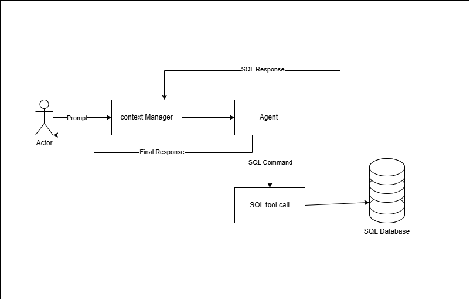

# T2S Agent



A lightweight AI agent that connects an LLM to a small SQLite-backed inventory database. The project uses Ollama for model inference and a set of tool functions so the agent can inspect tables, describe schema, and execute SQL queries in response to user questions.

## Features

- Uses an Ollama-hosted language model for natural language interactions
- Provides SQL tools for:
  - listing tables
  - describing table schema
  - inspecting database structure
  - executing SQL queries
- Maintains conversation context and logging for each session
- Stores inventory data in a SQLite database

## Project Structure

- agent.py — main entry point for the agent loop
- inference.py — model loading and generation logic using Ollama
- contextBuilder/ — prompt/context building and history management
- database/ — database setup and models
- tools/ — SQL-related tools and tool registration
- logger/ — session and tool-call logging

## Requirements

Make sure you have:

- Python 3.9+
- Ollama installed and running
- An available Ollama model such as gemma4:e2b

Install the Python dependencies:

```bash
pip install ollama sqlalchemy
```

## Setup

1. Start Ollama on your machine.
2. Pull a model if needed:

```bash
ollama pull gemma4:e2b
```

3. Run the agent:

```bash
python agent.py
```

## Usage

The agent is currently configured with a sample prompt asking about the value of inventory. You can modify the prompt in [agent.py](agent.py) to test different questions against the database.

## Notes

- The current database model is based on a simple products table.
- The project is intended as a small example of tool-using agent behavior rather than a production-ready application.
- Logs are written to [logs.json](logs.json) during execution.
